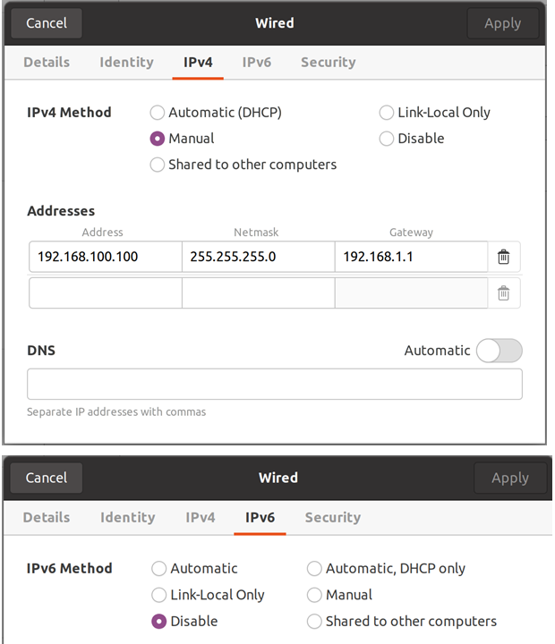
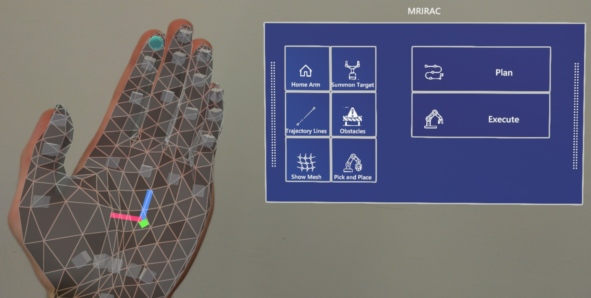
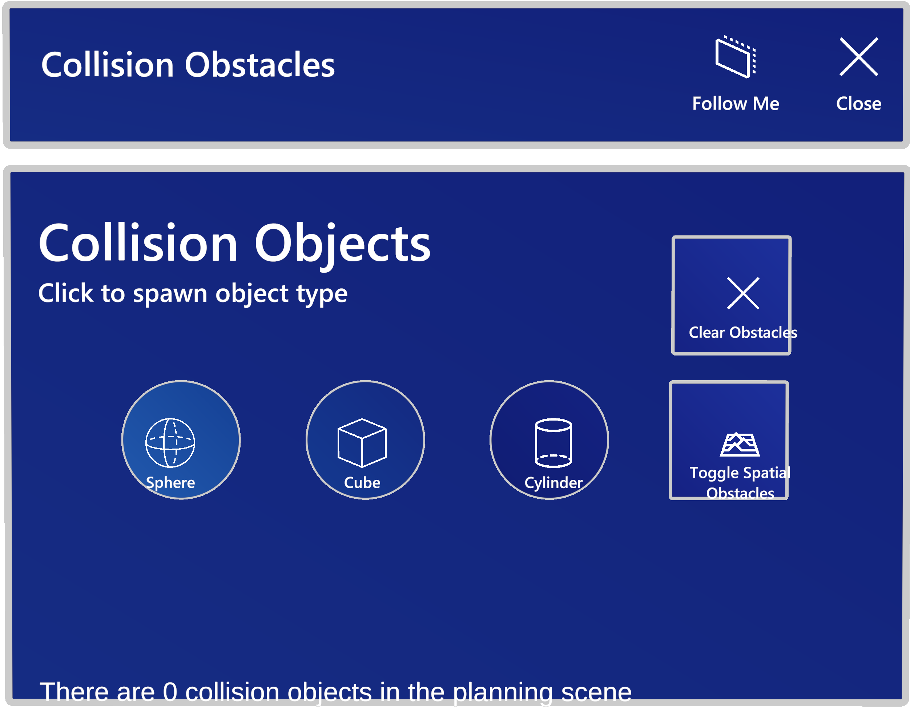
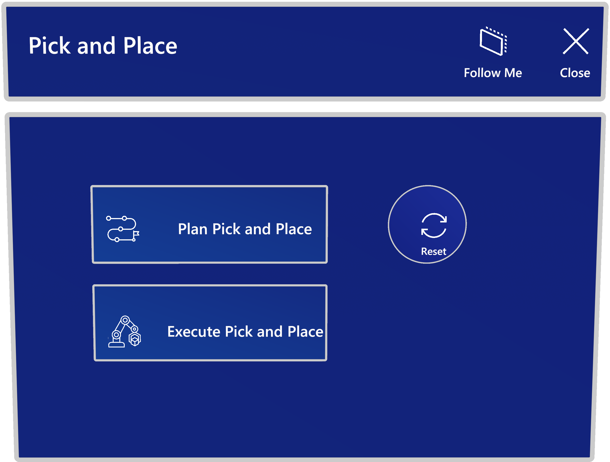

# Mixed Reality Industrial Robot Arm Control

Programming industrial robot arms can be a tedious and unintuitive process with conventional control methods, such as joysticks or 2D GUIs.

This repository contains both a Unity application and ROS packages that enable users to control a Kinova Jaco 2 robot arm using the Microsoft HoloLens 2 through a Mixed Reality experience. Besides being able to intuitively set pose targets for the robot directly in task space, there is also a demonstration for planning a simple pick and place task. Furthermore, the application utilizes the spatial awareness capabilities of the HoloLens 2 to provide information on obstacles that are in the robot workspace, enabling collision-aware motion planning of robot movements.

## Installation
### Hardware
Required hardware:
* Kinova Jaco 2 Robot
* Microsoft HoloLens 2
* External PC (Ubuntu 20.04)
* Printed QR codes for robot localization and object detection

#### Kinova Jaco 2 Robot
1. Mount the robot securely to a flat surface
2. Connect the power cable and the controller to the robot
3. Power on the robot and send the arm to the home position by holding the middle button on the controller

#### Microsoft HoloLens 2
Make sure the HoloLens 2 device is in [developer mode](https://learn.microsoft.com/en-us/windows/mixed-reality/develop/advanced-concepts/using-visual-studio?tabs=hl2#enabling-developer-mode). This is required in order to deploy the Unity application to the device.

#### External PC (Ubuntu 20.04)
As the robot arm does not have an internal computer capable of running the ROS components, a separate machine is required. This machine can be anything capable of running Ubuntu 20.04, such as an Intel NUC or a laptop. Note that running WSL2 on Windows also works but to our knowledge only when using the Kinova Arm in the Gazebo simulation. The Kinova Ethernet/USB integration to WSL is non-trivial though.

##### Ethernet Connection
Connect the Ethernet cable to the port on the robot and to a port on the PC. So that the PC can connect to the robot driver via the Ethernet connection, the wired connection has to be configured in the following way:




##### ROS
This project was developed using ROS Noetic. It may work with other ROS releases, but it is recommended to set up a Noetic environment on the external PC, using these [instructions](http://wiki.ros.org/noetic/Installation/Ubuntu).

#### QR Codes
Print out the [QR codes](doc/images/qr_codes/) used for robot and object localization. Generally, the detection improves with increased QR code size.

Place the QR code for robot localization on the flat surface that the robot is fixed to. When starting the application for the first time, detect the QR code by looking directly at it and the robot model should appear next to it. Move the QR code until the holographic robot model lines up with the real robot. You can then fix the QR code to the surface with tape.

The object used for the Pick and Place demo also requires a QR code to be attached, so that the HoloLens can localize it. The object used in the demo videos is a cylinder with a diameter of 7.5cm and a height of 13cm. Attach the QR code to the top of the cylinder as centrally as possible.

### Unity
1. Clone this repository and open the MRIRAC_Unity folder from the Unity Hub (tested with Unity 2020.3.40f1 - we suggest using this exact Unity version, as version up/down-grades sometimes break Unity projects)
2. In the Unity editor, open the ROS Settings from the Robotics menu and set the ROS IP Address to the IP of the external machine connected to the robot arm.
3. Build and deploy the application to your HoloLens 2 device, following these [instructions](https://learn.microsoft.com/en-us/windows/mixed-reality/develop/unity/build-and-deploy-to-hololens) 
### ROS
1. In the src/ folder of a new or existing catkin_ws, clone this repository
2. Clone the following repositories into the same catkin_ws
```
cd ~/catkin_ws/src
git clone --branch noetic-devel git@github.com:Kinovarobotics/kinova-ros.git
git clone git@github.com:Unity-Technologies/ROS-TCP-Endpoint.git
```
3. Open `kinova-ros/kinova_bringup/launch/config/robot_parameters.yaml` in your favorite text editor, and change the `connection_type` parameter from `USB` to `Ethernet` (line 13)
4. Make sure you have [rosdep](http://wiki.ros.org/rosdep) installed and configured and use it to install the required dependencies
```
cd ~/catkin_ws
rosdep install --from-paths src --ignore-src -r -y
```
5. Build and source the workspace with `catkin build && source devel/setup.bash`
6. Test the setup by running `roslaunch mrirac kinova_real.launch` or alternatively (if you don't have a Kinova arm available or setup) you can launch the Gazebo simulation using `bash MRIRAC_ROS/mrirac/launch_sim.bash`.
 
If the robot is connected correctly and the setup was successful, you should be able to set a pose goal using the rviz interface and the robot will move to that position once `plan and execute` is pressed.

## Usage
This section aims to provide a brief guide on how to use the core functions of the Mixed Reality experience.

A collection of demonstrations is available here: https://youtube.com/playlist?list=PLihM5VMGCK942veA_fDujf4P7h3gCeHFv

### Starting the Applications
#### External PC
Start the ROS components:
```
roslaunch mrirac kinova_real.launch
```
#### HoloLens
From the Application Menu, start the `MRIRAC` app

### Hand Menu UI


* **Home Arm**: Send arm to 'Home' position
* **Summon Target**: Summon pose target hologram
* **Trajectory Lines**: Toggle display of trajectory lines
* **Obstacles**: Open Collision Obstacle UI
* **Show Mesh**: Toggle display of spatial awareness mesh
* **Pick and Place**: Open Pick and Place UI

### Sending Robot to a Target Pose
https://user-images.githubusercontent.com/48822654/217340937-584c06a8-cff5-4365-ae4e-be78d66b367a.mp4

### Collision Obstacle UI



* **Sphere**: Instantiate a spherical hologram obstacle
* **Cube**: Instantiate a cubic hologram obstacle
* **Cylinder**: Instantiate a cylindrical hologram obstacle
* **Clear Obstacles**: Remove all obstacles from the planning scene
* **Toggle Spatial Obstacles**: Toggle transmission of spatial awareness mesh information

https://user-images.githubusercontent.com/48822654/217341050-a7dd433c-f838-47ca-af97-89ff8a9c1102.mp4

https://user-images.githubusercontent.com/48822654/217341097-46c50b44-8e57-4228-8b9d-82c9a70898a5.mp4

### Pick and Place UI



* **Plan Pick and Place**: Plan pick and place mission
* **Execute Pick and Place**: Execute planned pick and place mission
* **Reset**: Reset detection of pick target (removes added obstacle)

https://user-images.githubusercontent.com/48822654/217341190-aaafd8b8-9d07-454b-926e-0d94b50aba9a.mp4

## Credits
This project was developed as part of the Semester Thesis for my (Matthew Hanlon) MSc. Robotics, Systems and Control at ETH Zurich. The project was supervised by Eric Vollenweider (Microsoft Mixed Reality and AI Lab Zurich), in collaboration with the [Computer Vision and Geometry Group](https://cvg.ethz.ch/).

# Trademark Notice
Trademarks This project may contain trademarks or logos for projects, products, or services. Authorized use of Microsoft trademarks or logos is subject to and must follow Microsoft’s Trademark & Brand Guidelines. Use of Microsoft trademarks or logos in modified versions of this project must not cause confusion or imply Microsoft sponsorship. Any use of third-party trademarks or logos are subject to those third-party’s policies.
